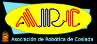

# EuRobotics Engineering Hardware
Hardware del equipo Eurobotics Engineering para el desarrollo de robots participantes en Eurobot.

## Organización

 - Cada carpeta del repositorio se corresponde con una tarjeta.

 - En el root de cada capeta se encuentra el proyecto de desarrollo de la tarjeta (Eagle, Orcad, Altium...). Si es una tarjeta comercial la documentación dada por el fabricante.

 - Por lo general, los archivos de cada proyecto se nombran como MMMMM_rXX, donde XX es la revisión y MMMMM el nombre de la tarjeta. La modificaciones sobre tarjetas fabricadas se documentan añadiendo al nombre del fichero de diseño el sufijo _NNNN_rYY_, donde NNNN es el identificador de la modificacion y YY es el número revisión de la modificación. Por ejemplo: "mainboard_r15_eurobot2012_r1.pdf" es la modificación para eurobot 2012 con revisión 1 de la tarjeta mainboard correspondientes a la revisión 15 de los esquemas.

 - Cada carpeta de una tarjeta desarrollada puede contener las siguientes subcarpetas:
   + bom: listado de materiales.
   + cam: ficheros de fabricación y versión en pdf de versiones de tarjetas fabricadas o de modificaciones en placa realizadas para una edición concreta de Eurobot.

## dsPIC Protoboard

Tarjeta prototipo basada en microcontrolador dspic33. Desarrollada para Eurobot 2010. Diseñada en Eagle (sólo esquematicos). Fabricada sobre tarjeta de prototipos. Es la tarjeta que se utilizó en el robot prototipo, llamado Dumybot, con el que se portó las librerías Aversive.

### Características

* Control motores: DC, Dunkermotoren, servos, AX12.
* Comunicaciones: RS-232, BT, SPI, I2C
* Sensores: industriales, TTL, laser analógico y encoders en cuadratura
* GPIOS: puerto de expansión I2C de 16 E/S.

### Autor

Javier Baliñas Santos

## Mainboard V01/V02

Tarjeta principal del robot. Compuesta por dos microcontroladores dspic33 comunicados por I2C, un maestro y un esclavo. El maestro está pensado para implementar la navegación motriz y estrategia del robot, y el
esclavo para controlar la mecánica del robot.

Desarrollada para el robot de Eurobot 2010. Diseño en Eagle (esquemáticos y PCB). Tiene varios bugs documentados y solucionados en la versión 2.

La versión V02 de la tarjeta principal soluciona algunos errores de la versión V01. Desarrollada para Eurobot 2012 y utilizada en las ediciones posteriores.

### Características

* 3 motores Dunkermotoren
* 2 motores DC de 12V
* 1 solenoide 12V
* 1 relé
* 2 telémetros lásers
* 5 servos estándar
* 1 interfaz servos AX12
* 3 encoders con salida en cuadratura
* 7 sensores 12V
* 1 interfaz RS-232
* 2 interfaces Bluetooth (SPP)
* 1 conector para tarjeta de sensores _sensorboard_

### Autor

Javier Baliñas Santos

## Mainboard V03

Tercera versión de la tarjeta principal de los robots. Compuesta por un único un microcontrolador.

Desarrollada para Eurobot 2014 y utilizada en las ediciones posteriores.

### Características
* 3 motores DC de 12V
* 4 servos estándar
* 1 interfaz servos AX12
* 2 encoders con salida en cuadratura
* 1 encoder con salida en cuadratura (módulo x4, sin decodificación de signo)
* 16 E/S de 12/5V
* 2 entradas de captura de tiempo
* 1 interfaz RS-232/Bluetooth
* 1 interfaz I2C
* 1 interfaz SPI

### Autores

Diseño electrónico: Javier Baliñas Santos  
Diseño PCB: Rubén Espino San José

## Sensorboard

Tarjeta de expansión E/S digital por I2C (32 E/S). Desarrollada para Eurobot 2010 y reutilizada en las siguientes ediciones.

### Autor

Javier Baliñas Santos

## Swithboard

Tarjeta de distribución de alimentación de los robots. Permite activar de forma independiente las diferentes alimentaciones del robot: 24V, 12V y 5V. Desarrollada para Eurobot 2010 y reutilizada en las siguientes ediciones. Diseño en Eagle (esquemáticos y PCB).

### Autor

Javier Baliñas Santos

## Beaconboard

Electrónica de la baliza desarrollada para Eurobot 2010 por Diego Salazar. Permite el control de 1 motor DC con encoder en cuadratura, la lectura de 2 sensores de tipo Keyence y de 2 sensores opticos de herradura. Permite la comunicación por Bluetooth. Tiene bugs resueltos en placa, pero no todos documentados. Diseño en Orcad (esquemas y PCB).

### Autor

Diego Salazar Arcucci

## Vacuumboard

Tarjeta de control de hasta 4 electrovalvulas y 4 bombas de vacio.

### Autores

Diseño electrónico: Javier Baliñas Santos  
Diseño PCB: Rubén Espino San José

## M4 ATX

Fuente de alimentación mini ATX. Perminte un rango de alimentación variable y da salidas de +/-12V, 5V y 3.3V.  Se ha utilizado desde Eurobot 2010 para alimentar la electrónica del robot a partir de baterías. Es una tarjeta comercial.

## Licencia

Todos estos productos están liberados mediante [Creative Commons Attribution-ShareAlike 4.0 International License](http://creativecommons.org/licenses/by-sa/4.0/).  
_All these products are released under [Creative Commons Attribution-ShareAlike 4.0 International License](http://creativecommons.org/licenses/by-sa/4.0/)._
